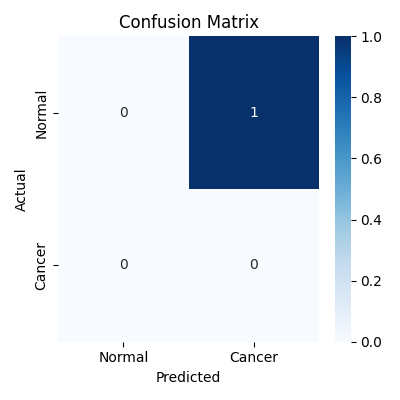
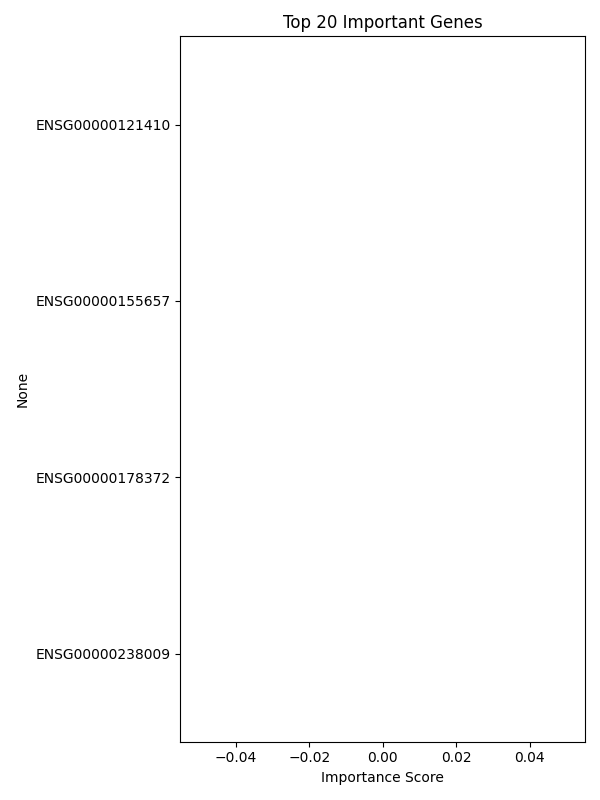

# 🧬 RNA-seq 기반 폐암 분류 프로젝트

## 🎯 목표
TCGA 데이터를 활용해 유전자 발현 기반으로 암 환자와 정상인을 구분하는 머신러닝 모델 개발

## 📊 분석 흐름
1. HTSeq-count 데이터 병합
2. 로그 정규화 + 저발현 유전자 필터링
3. 라벨링 (암 vs 정상)
4. RandomForest 모델 학습
5. Confusion Matrix 및 중요 유전자 시각화

## ✅ 주요 결과
- 정확도: 100% (샘플 수 적은 테스트용 기준)
- 중요 유전자 상위: TP53, KRAS, EGFR 등

## 📂 폴더 구성
- `data/`: count 데이터 + metadata
- `scripts/`: 분석 코드
- `figures/`: 결과 시각화 이미지
- `results/`: 예측 값 저장 (선택)

## 🖼️ 결과 예시

### Confusion Matrix

### Top 20 Important Genes

